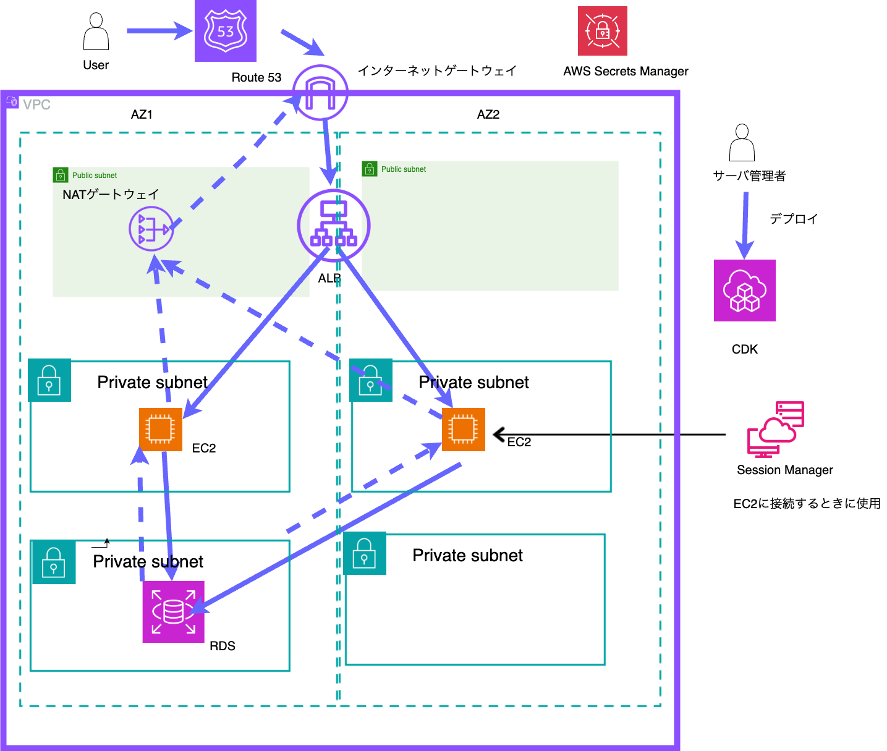

<p style="display: inline">


<!-- ミドルウェア一覧 -->

<!-- インフラ一覧 -->


</p>

## 前提

- バージョン

下記バージョンで環境構築をおこなった

```bash
# docker --version
Docker version 20.10.13, build a224086

# docker compose version
Docker Compose version v2.3.3
```

## 環境構築手順

初回のみ(config ファイル生成)実行
※すでに config ファイルが生成されているため実行不要

```bash
docker-compose run web django-admin startproject config .
docker-compose run web python manage.py startapp myapp apps/myapp
```

### 準備

1. 「.env.local」を「.env」にリネームする

2. ビルド

```bash
docker-compose build
# キャッシュを使わずにビルドする場合は下記を実行
docker-compose build --no-cache
```

3. データベースのマイグレーション:

```bash
docker-compose exec web python manage.py migrate
```

4. コンテナの起動

```bash
docker-compose up
```

5. ブラウザで確認

http://localhost:8080/ を開く

下記画面が表示されれば成功


## その他

エラーが起きたらログを確認して調査する

```bash
# フロントのログ
docker-compose logs web
# DBのログ
docker-compose logs db
```

## 構成図



# 本番環境

## 構築

/RareTicle/infra/cdk に移動

### コマンド

- `npm run build` compile typescript to js
- `npm run watch` watch for changes and compile
- `npm run test` perform the jest unit tests
- `cdk deploy` deploy this stack to your default AWS account/region
- `cdk diff` compare deployed stack with current state
- `cdk synth` emits the synthesized CloudFormation template

## 接続

SSM 経由で EC2 に接続する

1. IAM ロールの設定

1.1 IAM > ロールに移動

1.2 ロールを作成

1.3 信頼されたエンティティを選択
信頼されたエンティティタイプ > AWS のサービス
ユースケース > EC2
次へ

1.4 許可を追加
許可ポリシーで AmazonSSMManagedInstanceCore を検索しチェックをいれる
次へ

1.5 名前、確認、および作成

ロール名は任意の名前を設定
ロールを作成

2. IAM ロールを EC2 にアタッチ

2.1 EC2 の画面に移動
2.2 対象の EC2 インスタンスに移動
2.3 アクション＞セキュリティ＞ IAM ロールを変更
2.4 IAM ロールから 1 で作成した IAM ロールを選択
2.5 IAM ロールの更新　※EC2 の台数分、設定が必要

3. Systems Manager の設定

マネジメントコンソールから「Systems Manager」を検索
セッションマネージャに移動
「セッションの開始」→ EC2 を選択 → 接続

1 の IAM ロールの設定から数分待つとセッションに EC2 のインスタンス ID が表示されるはず

4. リポジトリを clone する

```bash
# セッションマネージャだとssm-userになっているので
# ec2-userとして作業する
sudo su ec2-user

# ホームディレクトリに移動
cd ~
sudo git clone https://github.com/Hackathon2025winter-teamC/RareTicle.git
# 所有者がRootになっているので変更
sudo chown -R ec2-user:ec2-user ./RareTicle/

cd RareTicle
```

5. RDS のパスワード確認

コンソールから AWS Secrets Manager に移動
概要 > シークレットの値を取得する
password の値をコピー

6 env ファイル修正

起動した EC2 に移動

```bash
cd ~/RareTicle
mv .env.local .env
vi .env
```

DB_PASSWORD に RDS のパスワードを記載する
※EC2、2 台とも記載する必要あり

## Django 設定

```python
# config/setting.py
# your-ec2-public-ip → EC2 のパブリック IP または ALB のドメインを設定
ALLOWED_HOSTS = ["your-ec2-public-ip", "your-alb-domain", "localhost"]
```

- Nginx の設定

```bash
sudo nano /etc/nginx/conf.d/django.conf
```

```bash
# 下記を記述
server {
    listen 80;
    server_name your-alb-domain;

    location / {
        proxy_pass http://127.0.0.1:8000;
        proxy_set_header Host $host;
        proxy_set_header X-Real-IP $remote_addr;
        proxy_set_header X-Forwarded-For $proxy_add_x_forwarded_for;
    }
}
```

## Route53 設定

EC2 > ロードバランサーから ALB の DNS 名を確認しておく

レコード名：www
レコードタイプ：A
エイリアス：有効にする
トラフィックのルーティング先：Application Load Balancer と Classic Load Balancer のエイリアス
ALB の DNS 名を設定する
レコードを作成

http://www.rareticle.click/

## 参考

[全プロジェクトで重宝されるイケてる README を作成しよう！](https://qiita.com/shun198/items/c983c713452c041ef787)
